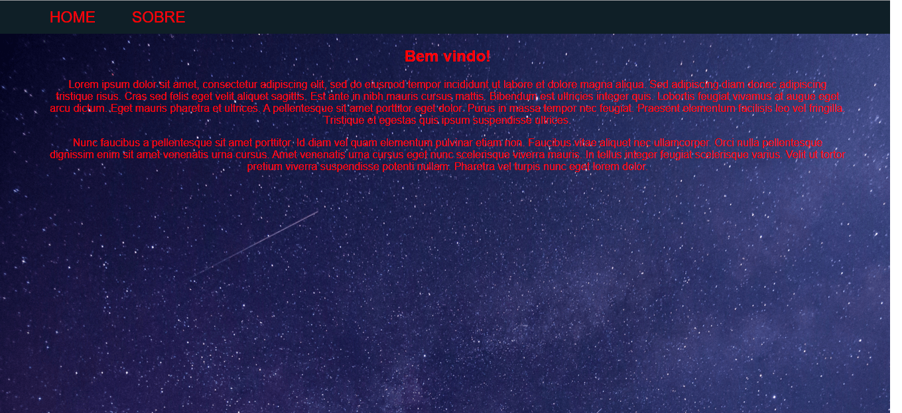

# SPA-Angular

Uma pequena Aplicação de Página Única (SPA) com duas rotas apenas.

# Diretivas

Esse projeto utiliza o [Angular CLI](https://github.com/angular/angular-cli).

# Pré-requisitos
<ul>
	<li>nodeJs</li>
	<li>npm</li>
</ul>

# Install

Abra o CMD ou terminal 
	Instale o Angular CLI, através dele vamos iniciar o servidor local para executar a aplicação. 
`npm -g install "@angular/cli"`   
	Instale o Typescript que também tá no NPM. 
`npm install -g typescript`   
	Para verificar se esta tudo certo 
`ng --version`   
	Para iniciar o servidor local para rodar o projeto. 
`ng serve`  
	Acesse a URL indicada, por exemplo, `http://localhost:4200` para vizualizar o projeto. 
